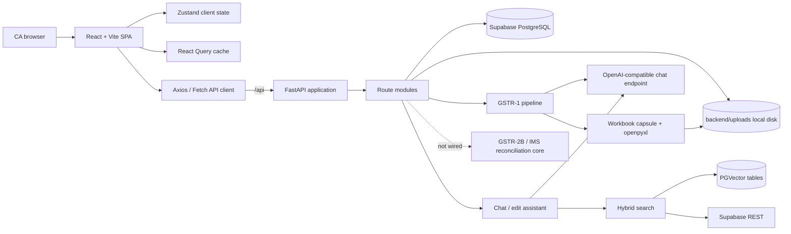
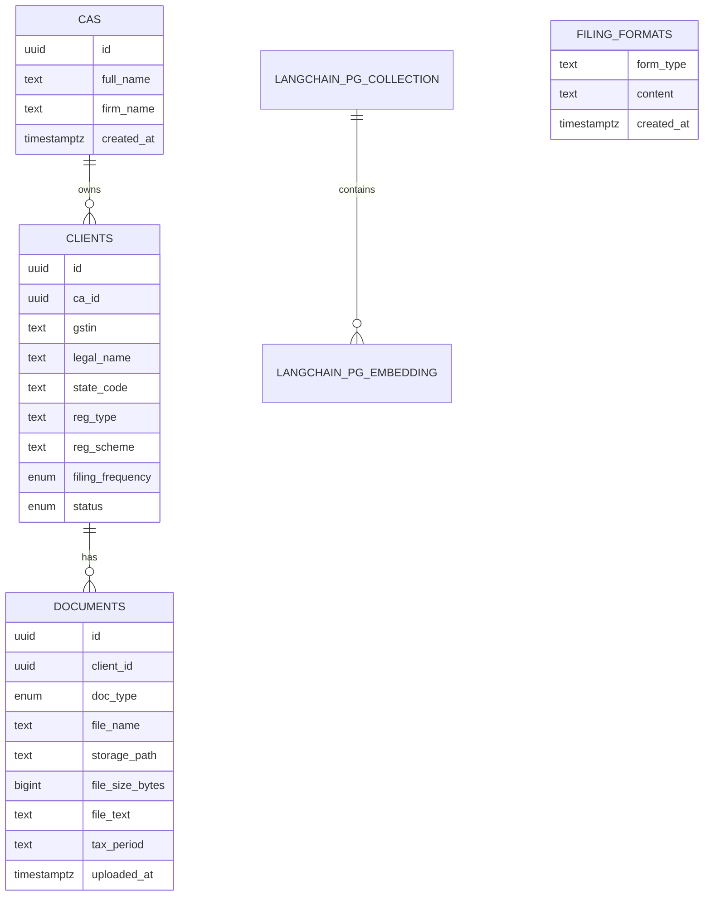
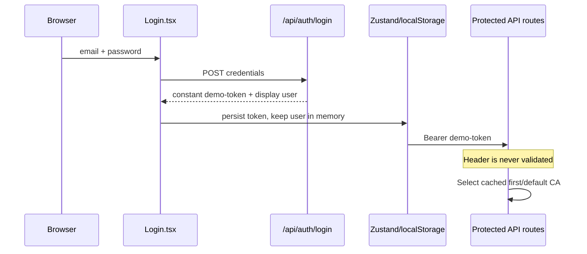
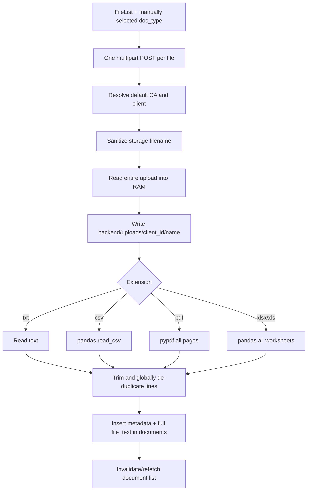
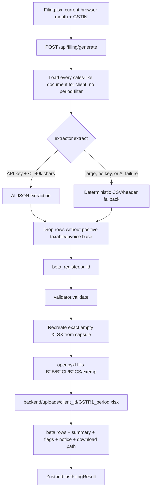
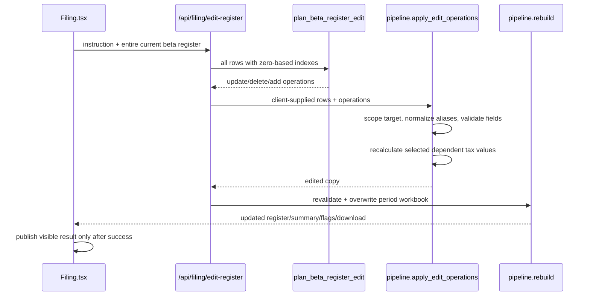
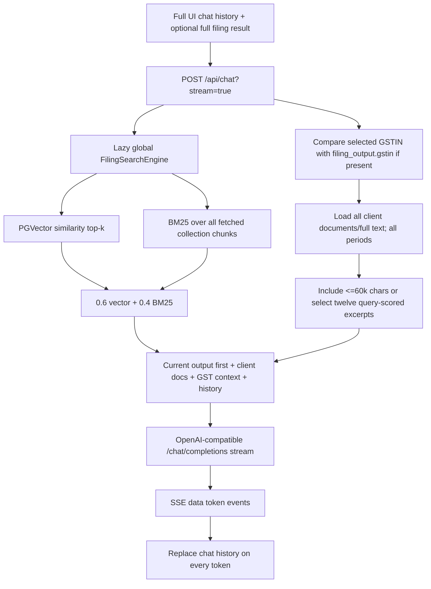
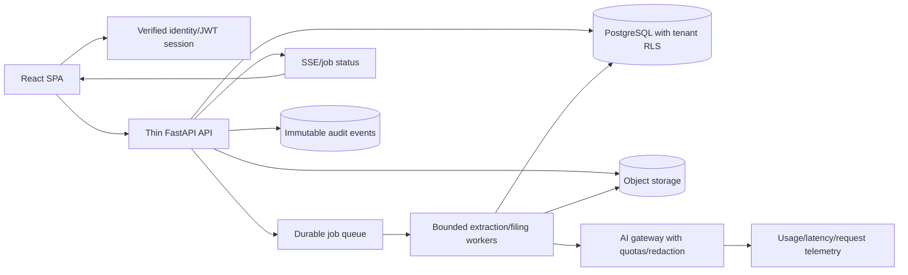

# AICA_shreemaya Project Documentation

Technical snapshot of `AICA_shreemaya` at commit `50b427c`, refreshed on 18 July 2026 to include the new untracked GSTR-2B/IMS reconciliation core and tests.

This document is based on the live repository, not only on `README.md`. It covers all 71 tracked files, 21 currently untracked authored backend reconciliation/test/dependency files, the active untracked configuration convention, every exposed API, the main frontend and backend pipelines, current implementation status, and file-specific correctness, security, maintainability, and scaling risks.

> Important: this is a technical implementation audit, not certification that the GST rules, thresholds, workbook layout, or legal reference corpus are current or statutorily correct. Those items need separate CA/legal review against current official sources.

## Contents

- [1. Review scope and evidence](#1-review-scope-and-evidence)
- [2. Executive summary](#2-executive-summary)
- [3. Product status: implemented versus presented](#3-product-status-implemented-versus-presented)
- [4. Architecture](#4-architecture)
  - [4.1 Runtime layers](#41-runtime-layers)
  - [4.2 Inferred database model](#42-inferred-database-model)
- [5. API catalogue](#5-api-catalogue)
- [6. Pipeline maps](#6-pipeline-maps)
  - [6.1 Application startup and production serving](#61-application-startup-and-production-serving)
  - [6.2 Current authentication pipeline](#62-current-authentication-pipeline)
  - [6.3 Client registry and selection](#63-client-registry-and-selection)
  - [6.4 Document upload and extraction](#64-document-upload-and-extraction)
  - [6.5 Deterministic prerequisite pipeline](#65-deterministic-prerequisite-pipeline-currently-bypassed)
  - [6.6 AI requirement pipeline](#66-ai-requirement-pipeline-currently-bypassed)
  - [6.7 GSTR-1 generation pipeline](#67-gstr-1-generation-pipeline)
    - [Current classification behavior](#current-classification-behavior)
  - [6.8 Register edit pipeline](#68-register-edit-pipeline)
  - [6.9 Filing Ask and RAG pipeline](#69-filing-ask-and-rag-pipeline)
  - [6.10 Knowledge ingestion pipeline](#610-knowledge-ingestion-pipeline)
  - [6.11 Notice, knowledge, dashboard, and settings pipelines](#611-notice-knowledge-dashboard-and-settings-pipelines)
  - [6.12 Production frontend pipeline](#612-production-frontend-pipeline)
  - [6.13 GSTR-2B/IMS shared reconciliation core](#613-gstr-2bims-shared-reconciliation-core-implemented-not-wired)
- [7. Configuration contract](#7-configuration-contract)
  - [7.1 AI provider API-key usage: OpenAI and Anthropic](#71-ai-provider-api-key-usage-openai-and-anthropic)
    - [Provider summary](#provider-summary)
    - [OpenAI call-site map](#openai-call-site-map)
    - [Credential boundaries and maintenance rules](#credential-boundaries-and-maintenance-rules)
- [8. File-by-file code map: root and backend application](#8-file-by-file-code-map-root-and-backend-application)
  - [8.1 Root files](#81-root-files)
  - [8.2 Backend package, application, configuration, and database](#82-backend-package-application-configuration-and-database)
  - [8.3 Backend API helpers and schemas](#83-backend-api-helpers-and-schemas)
  - [8.4 Backend route files](#84-backend-route-files)
  - [8.5 Backend service files](#85-backend-service-files)
  - [8.6 Filing checks outside the GSTR-1 engine](#86-filing-checks-outside-the-gstr-1-engine)
- [9. File-by-file code map: GSTR-1 engine, workbook asset, migrations, and knowledge seeds](#9-file-by-file-code-map-gstr-1-engine-workbook-asset-migrations-and-knowledge-seeds)
  - [9.1 GSTR-1 engine](#91-gstr-1-engine)
  - [9.2 Workbook recreation package and embedded asset](#92-workbook-recreation-package-and-embedded-asset)
  - [9.3 Database migrations](#93-database-migrations)
  - [9.4 Backend dependency and knowledge-seed files](#94-backend-dependency-and-knowledge-seed-files)
  - [9.5 GSTR-2B/IMS reconciliation core](#95-gstr-2bims-reconciliation-core)
  - [9.6 Reconciliation test and development dependency files](#96-reconciliation-test-and-development-dependency-files)
  - [9.7 Runtime-only backend paths](#97-runtime-only-backend-paths)
- [10. File-by-file code map: frontend](#10-file-by-file-code-map-frontend)
  - [10.1 Frontend build and configuration files](#101-frontend-build-and-configuration-files)
  - [10.2 Frontend bootstrap, shared state, contracts, and API layer](#102-frontend-bootstrap-shared-state-contracts-and-api-layer)
  - [10.3 Shared frontend components](#103-shared-frontend-components)
  - [10.4 Frontend pages](#104-frontend-pages)
- [11. Cross-cutting trust boundaries and data lifecycle](#11-cross-cutting-trust-boundaries-and-data-lifecycle)
  - [11.1 Current sensitive-data copies](#111-current-sensitive-data-copies)
- [12. Why the current design will fail as load grows](#12-why-the-current-design-will-fail-as-load-grows)
  - [12.1 Database connections](#121-database-connections)
  - [12.2 CPU and memory](#122-cpu-and-memory)
  - [12.3 Concurrency and durability](#123-concurrency-and-durability)
  - [12.4 External-service capacity](#124-external-service-capacity)
- [13. Recommended target architecture](#13-recommended-target-architecture)
- [14. Remediation plan](#14-remediation-plan)
  - [Phase 0: stop unsafe exposure](#phase-0-stop-unsafe-exposure)
  - [Phase 1: production reliability](#phase-1-production-reliability)
  - [Phase 2: scale and completeness](#phase-2-scale-and-completeness)
- [15. Required test strategy](#15-required-test-strategy)
  - [15.1 Filing unit tests](#151-filing-unit-tests)
  - [15.2 GSTR-2B/IMS reconciliation tests](#152-gstr-2bims-reconciliation-tests)
  - [15.3 Workbook contract tests](#153-workbook-contract-tests)
  - [15.4 API/security integration tests](#154-apisecurity-integration-tests)
  - [15.5 Frontend tests](#155-frontend-tests)
  - [15.6 RAG tests](#156-rag-tests)
  - [15.7 Load tests](#157-load-tests)
- [16. Local runbook for this checkout](#16-local-runbook-for-this-checkout)
  - [Backend](#backend)
  - [Frontend](#frontend)
  - [Validation commands](#validation-commands)
  - [Production notes](#production-notes)
- [17. README and product-copy drift to correct](#17-readme-and-product-copy-drift-to-correct)
- [18. Authoritative files for future maintenance](#18-authoritative-files-for-future-maintenance)
- [19. Final assessment](#19-final-assessment)

## 1. Review scope and evidence

Reviewed:

- All tracked root, backend, frontend, migration, workbook-capsule, and knowledge-seed files.
- The active environment-loading code and environment variable names. Secret values were intentionally not copied.
- FastAPI's generated OpenAPI path list.
- Cross-file callers between the React UI, API client, routes, services, filing engine, database, local storage, OpenAI calls, PGVector, and workbook writer.
- The new `backend/app/recon` shared GSTR-2B/IMS core and all files under `backend/tests/recon`.
- Generated/runtime directories only as architectural artifacts: `.venv/`, `frontend/node_modules/`, `frontend/dist/`, `backend/uploads/`, `__pycache__/`, and `.git/` were not treated as authored source.

Verification run during this review:

| Check | Result |
|---|---|
| Python `compileall` over `backend/app` | Pass |
| Python `pip check` | Pass |
| Frontend `npm run build` | Pass, with a CSS `@import` ordering warning |
| Frontend `tsc --noEmit` | **Fail** at `frontend/src/pages/filing/Filing.tsx:128` |
| New reconciliation tests | **Pass: 160 tests** via `py -m pytest backend\tests\recon -q` on 18 July 2026 |
| Automated tests outside reconciliation | None found |
| Git worktree at this refresh | New reconciliation source/tests, `requirements-dev.txt`, and this document are currently untracked |

## 2. Executive summary

AICA is a React/FastAPI prototype for Indian CA practices. Its strongest implemented path is:

1. Create/select a GSTIN client.
2. Upload a sales register or invoice file.
3. Extract document text and store it against the client.
4. Generate a standardized four-bucket GSTR-1 beta register.
5. Validate a limited set of fields and write four sheets in a government workbook template.
6. Review/download the result, ask questions about it, or request a natural-language row edit.

The current code is suitable for controlled prototype use, but it is not safe for real multi-user production deployment yet. The most important blockers are:

A new deterministic reconciliation foundation now exists under `backend/app/recon`. It safely reads CSV/XLSX tables, normalizes identifiers/dates/amounts, canonicalizes confirmed document types, and reconciles purchase-register rows against GSTR-2B or IMS counterparty rows. Its 160-test suite passes. However, the checkout does not yet contain the `gstr2b` or `ims` orchestration packages described by the namespace comments, API routers, database migrations/tables, workbook exporters, or frontend screens. The existing `/api/filing/reconcile` route remains a disconnected placeholder, so this is an implemented and tested core library rather than a runnable end-to-end product module.

| Severity | Blocker | Primary owners |
|---|---|---|
| Critical | Login is a constant demo token; backend routes do not authenticate it. | `api/routes/auth.py`, `api/deps.py`, `frontend/src/App.tsx` |
| Critical | Every request uses one process-global “default CA”; authenticated tenant isolation does not exist. | `api/deps.py`, all DB routes |
| Critical | Unvalidated `period` text is embedded in workbook paths and can traverse outside the client directory. | `models/schemas.py`, `api/routes/filing.py` |
| Critical | GSTR-1 classification can make contradictory B2CL/POS/tax decisions and silently converts invalid GSTIN rows into B2C. | `filing/gstr1/beta_register.py` |
| Critical | Filing generation selects sales documents from every period, so one return can mix months and duplicate versions. | `api/routes/documents.py`, `api/routes/filing.py` |
| High | Readiness fails open as `ready` if the API key is missing, the AI call fails, or its result is unrecognized. | `filing/requirement_checking.py` |
| High | Uploads are unbounded, whole-file, blocking, overwrite by name, and use node-local disk. | `api/routes/documents.py`, `services/uploading.py` |
| High | Synchronous DB, pandas, PDF, OpenAI, RAG, and workbook work runs through `async` routes while connections remain checked out. | `core/db.py`, route modules |
| High | Filing results, edits, review status, and audit history are not persisted as versioned server records. | `api/routes/filing.py`, `frontend/src/store/appStore.ts` |
| High | Validation flags do not block workbook production/download, and validation covers only a small subset of portal rules. | `filing/gstr1/validator.py`, `pages/filing/Filing.tsx` |
| High | The repository lacks the base database schema, migration runner, application-wide tests/CI gates, and a reproducible Python lock; only the new reconciliation core has automated coverage. | `backend/migrations/`, `backend/tests/recon/`, `requirements.txt` |
| High | The tested GSTR-2B/IMS core is not connected to uploads, persistence, APIs, exports, or the frontend; the live reconcile endpoint still returns pending/empty data. | `app/recon/core/*`, `api/routes/filing.py` |

## 3. Product status: implemented versus presented

| Capability | Current state | Source of truth |
|---|---|---|
| Landing and login UI | Implemented presentation | `Landing.tsx`, `Login.tsx` |
| Authentication | **Demo stub**; accepts any non-empty credentials | `api/routes/auth.py` |
| Tenant/CA isolation | **Not implemented**; one cached default CA | `api/deps.py` |
| Client create/list/select | Implemented, single pseudo-tenant, no pagination/update/delete | `clients.py`, `ClientList.tsx` |
| Document upload/list | Partially implemented; local storage plus text extraction | `documents.py`, `uploading.py`, `Documents.tsx` |
| Tax-period capture | **Not implemented** during upload | `documents.py` |
| GSTR-1 generation | Prototype implemented for B2B, B2CL, B2CS, and Nil-rated | `filing/gstr1/*` |
| GSTR-2B reconciliation core | **Implemented and unit-tested** as a pure shared engine and CSV/XLSX reader; not exposed through API/UI | `recon/core/*`, `tests/recon/*` |
| IMS management/reconciliation core | Reuses the same engine contract and carries `ims_status`; IMS-specific ingestion/workflow/API/UI are **not present** | `recon/core/engine.py` |
| Reconciliation endpoint | **Stub**; does not call the new core | `api/routes/filing.py` |
| Government workbook | Four sheets populated; six other template sheets remain untouched | `template_writer.py`, `template_capsule.json` |
| Portal-ready GSTR-1 JSON | **Not implemented**; downloaded JSON is the internal beta register | `Filing.tsx` |
| Filing review/approval | UI toast only; not persisted or enforced | `Filing.tsx` |
| Filing Ask assistant | Implemented with current output, client documents, and optional RAG | `chat.py`, `chat_assistant.py` |
| Natural-language register edit | Implemented as AI-planned, server-applied operations | `filing.py`, `pipeline.py` |
| Durable filing/edit history | **Not implemented** | No filing/audit table or repository |
| Requirement checks | Two backend variants exist; UI bypasses both | `prerequisites.py`, `requirement_checking.py` |
| Dashboard | Client count is real; most metrics are zero/placeholder | `dashboard.py`, `Dashboard.tsx` |
| Notices | **Stub/placeholder** on both frontend and backend | `notices.py`, `Notice.tsx` |
| Knowledge page | Static explainer plus zero/static stats | `Knowledge.tsx`, `notices.py` |
| Knowledge ingestion | Library function only; no CLI/route/scheduler invokes it | `services/ingest.py` |
| Hybrid RAG | Implemented, but global, in-memory, stale until restart, and metadata-blind | `services/hybrid_search.py` |
| Settings | Theme works; firm profile and governance controls are display-only | `Settings.tsx` |

## 4. Architecture



### 4.1 Runtime layers

| Layer | Responsibility | Current boundary problem |
|---|---|---|
| React pages/components | User workflows and visual state | Several screens present unimplemented capabilities as complete. |
| `frontend/src/lib/api.ts` | HTTP/SSE contract | Handwritten, unvalidated contracts; no cancellation, timeouts, or auth recovery. |
| FastAPI routes | Request parsing and orchestration | Routes also perform blocking DB/filesystem/AI work and hold request-scoped connections. |
| Services | Upload extraction, RAG ingestion/search, AI prompts | No job boundary, retry policy, durable status, or shared observability. |
| Filing engine | Extraction, normalization, classification, validation, workbook writing | Deterministic core exists, but statutory coverage and validation are incomplete. |
| Reconciliation core | Lossless tabular reading, normalization, document-type confirmation, and deterministic two-sided matching | Pure/tested library only; no route, persistence, export, or UI layer is present. |
| PostgreSQL | CA/client/document metadata and text; LangChain vectors | Base schema is missing from the repo; no filing/audit persistence. |
| Local filesystem | Original uploads and generated workbooks | Not durable or shared across instances; filenames collide. |

### 4.2 Inferred database model

The repository does **not** contain the migrations that create the core tables or enums. The following is inferred from live SQL and must not be treated as a complete schema.



Missing from the current model/repository:

- Authoritative core-table and enum creation migrations.
- Filing jobs, filing versions, source-document joins, output hashes, review/approval state, edit events, notice records, and audit logs.
- Reconciliation uploads, field maps, normalized source rows, runs, results, exclusions, IMS actions/status history, and export artifacts.
- Confirmed indexes for client/document list queries and unique/version constraints.
- Row-level security policy definitions.

## 5. API catalogue

All backend endpoints are currently unauthenticated, even when the frontend sends a Bearer token.

| Method and path | Implementation | Status/risks |
|---|---|---|
| `GET /ping` | Returns `"pong"`. | Liveness only; app still cannot start without DB configuration. |
| `GET /api/health` | Returns process uptime/version. | Does not check DB, storage, RAG, or AI. |
| `POST /api/auth/login` | Returns constant `demo-token` and derives display name from email. | Stub; password ignored. |
| `POST /api/auth/logout` | Returns `{ok: true}`. | Stub; no session exists. |
| `GET /api/auth/me` | Returns `{user: null}`. | Stub; frontend does not call it at startup. |
| `GET /api/clients` | Lists all clients under default CA. | Unpaginated; pseudo-tenant only. |
| `POST /api/clients` | Inserts one client, conflicts on `(ca_id, gstin)`. | Assumes missing base unique constraint; fields largely free text. |
| `GET /api/clients/{gstin}` | Returns client plus empty nested stats/lists. | Repeats lookup; misleading placeholder detail. |
| `GET /api/clients/{gstin}/documents` | Lists document display rows. | Unpaginated; lacks IDs and extraction state. |
| `POST /api/clients/{gstin}/documents` | Saves one multipart file and extracted text. | Unbounded, blocking, overwrite-prone, no period. |
| `POST /api/filing/prerequisites` | Checks static document-type presence. | UI does not call it; blocked result still HTTP 200. |
| `POST /api/filing/requirements-check` | Sends all documents to AI and classifies readiness. | UI does not call it; fails open and returns document text. |
| `POST /api/filing/generate` | Runs GSTR-1 pipeline and writes workbook. | Ignores document period; path traversal; synchronous and overwrite-prone. |
| `GET /api/filing/download/{gstin}/{filename}` | Serves a generated workbook from client directory. | Basename blocks download traversal, but auth/tenancy is absent. |
| `POST /api/filing/edit-register` | AI plans operations; server applies/rebuilds. | Active edit path; client-supplied source, no version/audit. |
| `POST /api/filing/edit-output` | AI returns complete replacement CSV/JSON. | Legacy/unwired and insufficiently validated. |
| `POST /api/filing/edit-output-stream` | Streams complete replacement CSV/JSON format. | Legacy/unwired; errors are ordinary SSE text. |
| `POST /api/filing/reconcile` | Returns pending empty rows. | Stub; still acquires DB connection and does not import or call `app.recon.core`. |
| `POST /api/chat?stream=true|false` | Filing/notice assistant; optional SSE. | Loads all client periods; unbounded context; blocking non-stream path. |
| `POST /api/notices/classify` | Validates client, returns blank metadata. | Stub; upload is not read. |
| `POST /api/notices/draft-reply` | Returns empty draft. | Stub; does not verify client ownership. |
| `POST /api/notices/approve` | Echoes version and timestamp. | Stub; stores nothing. |
| `GET /api/notices/knowledge` | Returns zero counts and empty templates. | Stub. |
| `GET /api/dashboard` | Counts clients and returns zero/empty metrics. | Only client count is real. |

When `frontend/dist` exists, `main.py` also registers a catch-all `GET /{full_path}`. Unknown API GET paths can therefore return the SPA `index.html` with HTTP 200 instead of a JSON 404.

## 6. Pipeline maps

### 6.1 Application startup and production serving

```text
uvicorn app.main:app
  -> app/core/config.py loads backend/.env.<APP_ENV> (default .env.local)
  -> Settings is instantiated at import time
  -> FastAPI + CORS + seven routers are registered
  -> DB pool remains lazy
  -> if frontend/dist exists at import time:
       /assets is mounted and every remaining GET serves index.html
```

Scaling boundary: settings and static-route decisions require restart; there is no lifespan cleanup; a missing DB URL prevents even liveness startup; health is shallow.

### 6.2 Current authentication pipeline



This is a UI gate, not security. Any caller can invoke the API directly and operate on the same default CA.

### 6.3 Client registry and selection

```text
Dashboard/Clients page
  -> GET /api/clients
  -> get_db connection
  -> get_or_create_default_ca
  -> SELECT clients WHERE ca_id = cached default
  -> React Query cache
  -> user clicks row
  -> Zustand activeClient
  -> navigate to /filing
```

The selected client is browser-memory-only and not part of the URL. Reloading or opening a deep link loses it. Lists have no pagination and future tenant identity is absent from cache keys.

### 6.4 Document upload and extraction



Key failure modes:

- No byte/count/MIME/signature/decompression limits, malware scan, OCR, cancellation, or background job.
- `.xls` is advertised but `xlrd` is not declared.
- Duplicate-line removal can delete legitimate repeated transactions.
- Same sanitized name overwrites bytes while multiple DB rows remain.
- Disk write and DB insert are not transactional.
- `tax_period` is never accepted, so all downstream period filtering is impossible.

### 6.5 Deterministic prerequisite pipeline (currently bypassed)

```text
POST /api/filing/prerequisites
  -> static required doc_type list for GSTR_1 or GSTR_3B
  -> SELECT DISTINCT types for client (all periods)
  -> ready or blocked
```

Presence does not prove successful extraction or applicability. It treats optional scenarios such as exports/notes as universally mandatory, returns blocked as HTTP 200, and `/generate` does not enforce it. GSTR-3B has prerequisites but no generation pipeline.

### 6.6 AI requirement pipeline (currently bypassed)

```text
POST /api/filing/requirements-check
  -> load every document and full text for client (all periods)
  -> send 12 conceptual requirements + documents to OpenAI
  -> normalize AI present/missing/actions
  -> return result plus all document text
```

The conceptual requirements do not map directly to upload enum values. Missing key, network/AI failure, or unrecognized AI fields can all result in `ready`; this must become fail-closed or explicit `unknown` before it can gate filing.

### 6.7 GSTR-1 generation pipeline



#### Current classification behavior

| Rule | Code behavior | Risk |
|---|---|---|
| Registered buyer | Valid buyer GSTIN becomes B2B. | Invalid buyer GSTIN is erased and treated as B2C instead of being flagged. |
| Nil-rated | Nil/exempt/non-GST label or explicit 0% with zero tax. | All three legal categories are later collapsed into one Nil column. |
| B2CL | Any unregistered invoice above configurable threshold. | Inter-state condition is not checked. |
| B2CS | Remaining unregistered non-nil rows. | Can include large/inconsistent transactions when inputs are incomplete. |
| POS | B2B uses buyer GSTIN state; B2C forces client state unless derivation fails. | Explicit source B2C POS is ignored, so inter-state B2C can become intra-state. |
| Tax split | POS versus client state chooses IGST or CGST/SGST. | Wrong POS changes tax type; unknown state defaults toward CGST/SGST. |
| Monetary base | Taxable value, otherwise invoice value. | If invoice value is tax-inclusive, tax is added a second time. |
| Credit/debit notes | Voucher label changes, but row stays in four normal buckets. | Negative notes are dropped; dedicated CDNR/CDNUR sheets are not filled. |

Additional generation limits:

- Multiple sales registers/invoices can duplicate the same transaction; same-customer duplicates are not flagged.
- Floats rather than decimal currency arithmetic are used.
- AI extraction accepts any non-empty subset without completeness/provenance checks.
- Validation checks only GSTIN format, voucher format, and duplicate invoice numbers across different customers.
- Error flags do not stop workbook creation, download, or the UI's review toast.
- The output filename is both traversal-prone and deterministic, so concurrent work overwrites/races.

### 6.8 Register edit pipeline



The operation-based path is safer than accepting a model-generated full file, but important gaps remain:

- The server has no authoritative stored register/version to compare against; the entire starting register is trusted from the browser.
- Every row is sent to the model; large registers will exceed latency/context/cost limits.
- Concurrent edits have no version check, idempotency key, lock, or audit record.
- Editing GSTIN/bucket/invoice value does not necessarily recompute POS, bucket, and taxes; added rows receive little domain validation.
- Rebuild loses earlier extraction/tax-conflict flags and only reruns the limited validator.
- Workbook output is overwritten directly.

`/edit-output` and `/edit-output-stream` are older parallel paths that ask the model to replace the complete CSV and JSON. They are not called by the current frontend and should be removed or isolated until full schema/tax validation exists.

### 6.9 Filing Ask and RAG pipeline



Scaling/privacy boundaries:

- Total prompt size is not budgeted across output, documents, RAG, and history.
- Client financial text is sent to an external model without redaction/consent policy.
- The client-supplied filing output is labeled the source of truth.
- Message roles are unrestricted and forwarded to the model.
- BM25 loads the full collection into every worker, may be truncated by Supabase pagination defaults, and never refreshes after ingest.
- Retrieval errors silently degrade to an ungrounded answer.
- No retry/backoff, rate/cost quota, cancellation, request ID, token accounting, or durable chat audit exists.
- SSE errors arrive as normal HTTP-200 text tokens.

### 6.10 Knowledge ingestion pipeline

```text
Manual ingest_documents(path, collection)
  -> recursively load TXT/PDF/DOCX/CSV
  -> if text contains [CHUNK_ and ---: split raw delimiter blocks
     else RecursiveCharacterTextSplitter
  -> add SHA-256 as metadata (not used for deduplication)
  -> OpenAI embeddings
  -> PGVector add_documents
```

There is no caller, CLI entry point, route, scheduler, re-ingestion policy, or deletion/version workflow. Seed metadata remains inside page text rather than structured metadata, so validity dates, taxpayer type, jurisdiction, and source URLs cannot be reliably filtered or cited.

### 6.11 Notice, knowledge, dashboard, and settings pipelines

- Notice: the frontend dropzone has no input/handler; backend classify/draft/approve routes return empty success-shaped data and persist nothing.
- Knowledge page: calls a stub stats route, then renders static descriptions that overstate deduplication and startup indexing.
- Dashboard: fetches real client count and client list, but remaining backend metrics are zeros and the frontend adds default `Due`, `Med`, `50`, `+5`, and `review` values.
- Settings: theme changes local CSS state; firm profile, approval controls, and isolation controls have no save/enforcement API.

### 6.12 Production frontend pipeline

```text
npm run build -> frontend/dist
  -> split deployment: browser must receive VITE_API_BASE_URL at build time
  -> monolith: FastAPI detects dist only at process import and serves it
```

Current drift: `README.md` says `VITE_API_URL`, while code reads `VITE_API_BASE_URL`. BrowserRouter also requires a rewrite to `index.html` on split hosting. Unknown monolith API GETs can be swallowed by the SPA catch-all.

### 6.13 GSTR-2B/IMS shared reconciliation core (implemented, not wired)

```text
CSV/XLSX source path
  -> tabular.read_table preserves duplicate/ragged rows and native XLSX dates
  -> header detection uses confirmed aliases or a label-width fallback
  -> normalize GSTIN, document number, dates, text, and Decimal amounts
  -> CA-confirmed document-type map canonicalizes portal/accounting labels
  -> construct NormRow records for purchase-register and counterparty sides
  -> reconcile(period=YYYY-MM)
       -> surface out-of-period rows as excluded
       -> retain one exact PR duplicate and flag only extra copies
       -> group by GSTIN + document type + document number + date
       -> consolidate splits only on the counterparty side
       -> compare absolute invoice values with inclusive 1% PR-based tolerance
       -> protect zero/missing values and flag sign disagreements
       -> return deterministic worst-first results and per-status totals
```

The same pure `reconcile()` function is intended for GSTR-2B and IMS outward reconciliation; `ims_status` is carried on normalized rows but does not alter financial matching. Statuses are Matched, Mismatch, Missing Transaction, Extra Transaction, Duplicate Purchase Register Entry, and Needs Review for ambiguous purchase-register keys.

Current integration boundary:

- No `app/recon/gstr2b` or `app/recon/ims` package exists in this checkout.
- No upload/orchestration service converts `Table.records()` into persisted/validated `NormRow` objects.
- No router imports the package, and `main.py` registers no reconciliation router.
- No reconciliation schema migration, database repository, workbook/CSV exporter, IMS action writer, or frontend screen exists.
- Invalid `period` text currently disables filtering instead of raising a validation error; a production route must validate it before calling the engine.

## 7. Configuration contract

`backend/app/core/config.py` loads `backend/.env.<APP_ENV>` and defaults `APP_ENV` to `local`, making `backend/.env.local` the active local convention. That file is correctly ignored; values must not be committed or copied into documentation.

| Variable | Required/used | Notes |
|---|---|---|
| `APP_ENV` | Optional | Selects `.env.<value>`; default `local`. |
| `SUPABASE_DATABASE_URL` | Required at app import | Used by psycopg2 and PGVector. |
| `SUPABASE_URL` | Required for BM25 corpus fetch | Used through Supabase REST in `hybrid_search.py`. |
| `SUPABASE_SERVICE_KEY` | Required for BM25 corpus fetch | Broad service credential; protect and scope operational access. |
| `SUPABASE_JWT_SECRET` | Configured but unused | Authentication is not wired. |
| `OPENAI_API_KEY` | Optional at type level, operational for AI | Missing key changes extraction behavior and incorrectly fails readiness open. |
| `ANTHROPIC_API_KEY` | Present in the active local env file but **unused by this checkout** | Not declared in `Settings`, read by application code, or backed by an Anthropic dependency/model/base URL. |
| `OPENAI_CHAT_MODEL` | Optional default | Used for chat, extraction, and edit planner. |
| `OPENAI_BASE_URL` | Optional default | Direct `/chat/completions` coupling. |
| `OPENAI_EMBEDDING_MODEL` | Defined but ignored | `ingest.py` hard-codes its own model. |
| `OPENAI_REQUIREMENTS_MODEL` | Used but not in `Settings` | Separate environment lookup in requirement checker. |
| `RAG_CHUNK_SIZE` | Defined but ignored | Ingest defaults are hard-coded. |
| `RAG_CHUNK_OVERLAP` | Defined but ignored | Ingest defaults are hard-coded. |
| `RAG_TOP_K` | Defined but ignored | Search constructor defaults to 5. |
| `GSTR1_B2CL_THRESHOLD` | Used but not in `Settings` | Invalid values silently fall back to `100000.0`. |
| `CORS_ORIGINS` | Optional default `*` | Wildcard plus credentials is unsafe for production. |
| `VITE_API_BASE_URL` | Frontend build-time | Correct split-deployment variable; README names the wrong one. |

Configuration risks:

- `load_dotenv(..., override=True)` can overwrite real environment variables if a dotenv file is accidentally deployed.
- Settings are cached and require restart.
- Secrets are ordinary strings, and there is no startup validation by environment/profile.
- Several local env keys are unused by the tracked code; unused credentials should not be present in an app-specific runtime.

### 7.1 AI provider API-key usage: OpenAI and Anthropic

This section is based on a repository-wide scan of authored backend/frontend source, routes, tests, dependency manifests, `README.md`, and root documentation. Generated dependencies/build output were excluded. Secret values were not read or copied. A safe presence-only check found non-empty `OPENAI_API_KEY` and `ANTHROPIC_API_KEY` assignments in the ignored `backend/.env.local` file on 18 July 2026.

#### Provider summary

| Provider key | Current status | Where it enters the process | Actual consumers |
|---|---|---|---|
| `OPENAI_API_KEY` | **Actively used** | `backend/app/core/config.py` loads `backend/.env.<APP_ENV>` (normally `.env.local`) with `override=True`; most consumers read `get_settings().OPENAI_API_KEY`, while requirement checking and the LangChain embedding path read the process environment. | GSTR-1 extraction/readiness, filing chat/edit operations, OpenAI embeddings for RAG ingestion/search, and GSTR-2B/IMS client-message drafting. |
| `ANTHROPIC_API_KEY` | **Configured locally but unused in the current codebase** | The dotenv loader places the assignment in the Python process environment, but `Settings` does not define it and no application module calls `os.getenv("ANTHROPIC_API_KEY")`. | None. There is no Anthropic/Claude API request, SDK import, dependency, model variable, base URL, route, service, frontend call, or test. |

The current application is therefore OpenAI-backed, not dual-provider. Merely having `ANTHROPIC_API_KEY` in `.env.local` does not make any feature use Anthropic, and no client or filing data is sent to Anthropic by the source in this checkout.

#### OpenAI call-site map

| Feature and entry point | Code path | Credential/model/endpoint | Data sent | Behavior without the key or on failure |
|---|---|---|---|---|
| GSTR-1 transaction extraction via `POST /api/filing/generate` | `api/routes/filing.py` -> `filing/gstr1/pipeline.py` -> `filing/gstr1/extractor.py` | `get_settings().OPENAI_API_KEY`; `OPENAI_CHAT_MODEL`; `OPENAI_BASE_URL/chat/completions`; Bearer header | Combined raw text from the client's uploaded sales registers/invoices, up to 40,000 characters per call | Missing key, oversized input, provider error, or unusable response falls back to deterministic CSV/header parsing. |
| GSTR-1 readiness via `POST /api/filing/requirements-check` | `api/routes/filing.py` -> `filing/requirement_checking.py` | Direct `os.getenv("OPENAI_API_KEY")`; `OPENAI_REQUIREMENTS_MODEL` or hard-coded `gpt-4o-mini`; `OPENAI_BASE_URL/chat/completions`; Bearer header | GSTIN, period, required-document list, filenames, tax periods, and stored full document text | Missing key or AI failure currently returns success-shaped `ready` data. This is a fail-open correctness risk, not a safe readiness result. |
| Filing/notice assistant via `POST /api/chat` | `api/routes/chat.py` -> `services/chat_assistant.stream_chat()` | Settings-based key, `OPENAI_CHAT_MODEL`, and `OPENAI_BASE_URL/chat/completions`; Bearer header; streaming or non-streaming response | Chat history, GSTIN, current filing output, selected same-client document text, and optional RAG context | Returns an ordinary message saying the key is not configured; provider/network failures are also converted into reply text. |
| Natural-language filing edits via `POST /api/filing/edit-register`, `/edit-output`, and `/edit-output-stream` | `api/routes/filing.py` -> `services/chat_assistant.py` | Same settings-based key/model/base URL and Bearer header | Edit instruction plus the complete current beta register, or complete current filing CSV/JSON, GSTIN, and period | Operation planner/full-output edit raises an error; streaming edit yields an error string. The active `edit-register` route publishes changes only after server-side application/rebuild succeeds. |
| Knowledge ingestion and hybrid RAG search | `services/ingest.py` -> `langchain_openai.OpenAIEmbeddings`; `services/hybrid_search.py` reuses `EmbeddingService` | LangChain performs environment-based `OPENAI_API_KEY` discovery. The model is hard-coded as `text-embedding-3-small`; the configured `OPENAI_EMBEDDING_MODEL` is ignored, and the app does not pass `OPENAI_BASE_URL` into this constructor. | Knowledge-source chunks during ingestion and user search queries during vector retrieval | Ingestion fails when embedding setup/calls fail. Search-engine initialization catches failure and sets the global engine to `None`; later filing chat proceeds without RAG context. |
| GSTR-2B/IMS “Take Action” message drafting via `POST /api/recon/draft-message` and `POST /api/recon/results/{result_id}/message` | `api/routes/recon.py` -> `recon/messages.py` | Settings-based key, `OPENAI_CHAT_MODEL`, and `OPENAI_BASE_URL/chat/completions`; Bearer header | Client name and one reconciliation/IMS record's GSTIN, document reference/date/type/status, values, difference, and guidance | Missing key, provider error, or empty response uses a deterministic local message template, so drafting remains available without AI. |

#### Credential boundaries and maintenance rules

- Neither AI-provider key is referenced by frontend code or included in a browser bundle. The frontend's `Authorization: Bearer <token>` header carries the application's current demo login token to FastAPI; it is not an OpenAI or Anthropic key.
- `README.md` contains only an `OPENAI_API_KEY=sk-...` placeholder. It does not document Anthropic, and a real key must never replace that placeholder in a tracked file.
- `backend/.env.local` is ignored by `.gitignore` and is the correct current local-secret location. The document records only variable names and usage, never values.
- `load_dotenv(..., override=True)` means a deployed dotenv file can replace platform-injected credentials. Production should avoid shipping local env files and should use managed environment secrets.
- Direct Chat Completions callers send the Bearer key to the host configured by `OPENAI_BASE_URL`. Changing that URL changes the credential recipient; only a trusted endpoint should be configured.
- The embedding path is inconsistent with the other OpenAI consumers: it relies on LangChain environment discovery, hard-codes its model, and does not use the app's configured embedding model/base URL.
- The unused `ANTHROPIC_API_KEY` should be removed from this app's runtime environment unless an Anthropic-backed code path is intentionally added; reducing unused secrets limits accidental exposure.
- There is no provider abstraction, per-feature provider selection, key rotation/version metadata, secret-manager integration, or startup check that reports which AI capabilities are available.

## 8. File-by-file code map: root and backend application

Risk labels in this section describe the most important present or scaling concern, not an exhaustive bug list.

### 8.1 Root files

| File | What it does / problem targeted | Pipeline role | Specific issues and scaling risks |
|---|---|---|---|
| `.gitignore` | Keeps Python/Node artifacts, secrets, builds, uploads, logs, and agent handoff files out of Git. | Repository hygiene. | Correctly ignores `.env.local` and uploads, but there is no safe tracked `.env.example`; duplicate `dist/` rules are harmless; coverage/Vite metadata are not explicit. Ignoring uploads confirms they have no deployment durability contract. |
| `README.md` | Intended onboarding, stack, development, deployment, and GSTR-1 overview. | Human entry point. | Materially stale: wrong env filename, nonexistent `.env.example` and `src/hooks`, wrong frontend variable, old threshold, unsupported EXP/CDNR/CDNUR/HSN/portal-JSON claims, wrong output/download description, and theme drift. It must not be used as operational truth until updated. |
| `package-lock.json` | Empty npm lock at repository root. | None; no root `package.json` exists. | Likely accidental. It can make CI/hosting autodetect an empty Node project or run the wrong install directory. |

### 8.2 Backend package, application, configuration, and database

| File | What it does / problem targeted | Key symbols/callers | Specific issues and scaling risks |
|---|---|---|---|
| `backend/app/__init__.py` | Marks `app` as a Python package. | Imported by Uvicorn module resolution. | Empty and safe; no explicit package version/public surface. |
| `backend/app/main.py` | FastAPI composition root, CORS, routers, health, and optional React static serving. | `app`, `ping`, `health`, `serve_spa`. | Import requires DB configuration; broad CORS; shallow health; no pool shutdown/security/observability middleware; public docs; per-worker uptime; catch-all can turn unknown API GETs into HTML 200; static availability is decided only at import. |
| `backend/app/core/__init__.py` | Marks the core package. | Package marker. | Empty and safe. |
| `backend/app/core/config.py` | Loads environment-specific dotenv and exposes cached Pydantic settings. | `Settings`, `get_settings`, `cors_origins_list`. | `override=True`; mandatory DB URL couples all startup; unused configuration fields; missing production validation; plain-string secrets; cached values require restart; empty CORS elements are retained. |
| `backend/app/core/db.py` | Lazily creates a psycopg2 pool and commits/rolls back a request connection. | `get_pool`, `get_db`. | `SimpleConnectionPool` is not thread-safe; initialization can race; fixed 10 connections per worker; no wait timeout, liveness check, reconnect, metrics, or close hook; long AI/file work holds connections; sync DB calls block async endpoints; cursors are not explicitly closed. |

### 8.3 Backend API helpers and schemas

| File | What it does / problem targeted | Key symbols/callers | Specific issues and scaling risks |
|---|---|---|---|
| `backend/app/api/__init__.py` | Marks the API package. | Package marker. | Empty and safe. |
| `backend/app/api/deps.py` | Default-CA lookup, client ownership lookup, size display, and filing-frequency inference. | `get_or_create_default_ca`, `require_client`, `human_size`, `filing_frequency`. | Critical pseudo-tenancy; first-request races; stale/process-specific cache; a first inserted CA can be rolled back while its ID remains cached; no caller identity; duplicated GSTIN regex; `human_size(0)` is blank; free-text filing frequency guess. |
| `backend/app/api/routes/__init__.py` | Marks the route package. | Imported route modules are named explicitly in `main.py`. | Empty and safe; no central router/versioning surface. |
| `backend/app/models/__init__.py` | Marks the models package. | Package marker. | Empty and safe. |
| `backend/app/models/schemas.py` | Pydantic request types for auth, clients, documents, filing, chat, and notices. | `ClientCreate`, filing/edit requests, `ChatRequest`, `ApproveReplyRequest`. | Only client-create GSTIN/name are meaningfully validated. Period, GSTIN paths, roles, context, messages, instructions, HTML, CSV/JSON, and list sizes are unrestricted. Period enables path traversal; arbitrary roles reach the model. Response models are unused, and frontend/backend types are handwritten separately. |

### 8.4 Backend route files

| File | What it does / problem targeted | Main routes | Specific issues and scaling risks |
|---|---|---|---|
| `backend/app/api/routes/auth.py` | Presents login/logout/current-user endpoints. | `/api/auth/login`, `/logout`, `/me`. | Stub: password ignored, constant token, `/me` always null, nothing persisted/revoked/verified, no hashing/rate limit/audit/tenant binding. |
| `backend/app/api/routes/clients.py` | Creates, lists, and retrieves GSTIN clients. | `list_clients`, `create_client`, `get_client`. | Global default CA; no pagination/edit/archive/delete/audit; repeated detail query; hard-coded empty detail sections; free-text fields; constraint assumptions; unused imports; no response models. |
| `backend/app/api/routes/dashboard.py` | Supplies practice KPI payload. | `dashboard`. | Only client count is real; all other metrics are convincing placeholders. Count is recalculated on every request and no field-level implementation status exists. |
| `backend/app/api/routes/documents.py` | Lists and uploads client files, writes local bytes, extracts/stores text. | `secure_filename`, `list_documents`, `upload_document`. | No auth, limits, signature/MIME checks, malware/zip-bomb defense, immutable key, cleanup, pagination, period, extraction status, or storage/DB transaction. Whole-file memory and blocking parsing; filename overwrite; orphan files; original/sanitized-name mismatch; unknown/failed extraction still returns stored. |
| `backend/app/api/routes/chat.py` | Connects chat requests to current filing output, same-client documents, RAG, and AI streaming. | `chat`. | All periods/full documents queried per message; client-supplied output; ownership check only when output includes GSTIN; no role/size/rate/privacy controls; DB connection can be held through streaming; non-stream blocks event loop; SSE lacks heartbeat/buffering/cancellation semantics; AI errors become normal text. |
| `backend/app/api/routes/filing.py` | Orchestrates prerequisite checks, generation, downloads, edits, and reconciliation. | `generate_gstr1`, `edit_register`, `download_workbook`, legacy edit routes. | Critical period path traversal; all-period source selection; prerequisite bypass; deterministic filename races; blocking work while DB is open; no persisted filing/version; legacy full-output replacement attack surface; client-supplied register; error/status misclassification; stub reconcile; calculated prerequisite status code is unused. |
| `backend/app/api/routes/notices.py` | Intended notice classify/draft/approve/knowledge API. | `classify_notice`, `draft_reply`, `approve_reply`, `knowledge`. | Success-shaped stubs. File not read, client ownership inconsistent, HTML not sanitized/persisted, no notice/version/audit model, zero stats. Prefer explicit 501 until implemented. |

### 8.5 Backend service files

| File | What it does / problem targeted | Key symbols/callers | Specific issues and scaling risks |
|---|---|---|---|
| `backend/app/services/__init__.py` | Marks the services package. | Package marker. | Empty and safe. |
| `backend/app/services/uploading.py` | Converts TXT/CSV/PDF/XLS/XLSX into cleaned text for storage and later filing/chat. | `extract_and_clean`, per-format extractors, `_clean_text`. | Blocking and whole-file; all worksheets loaded; `.xls` lacks `xlrd`; no OCR/encoding/quality report; exceptions silently become `None`; global duplicate-line deletion can remove legitimate transactions; parser attack/large decompression exposure. |
| `backend/app/services/ingest.py` | Loads knowledge files, chunks them, creates embeddings, and appends to PGVector. | `DocumentLoadingService`, `chunk_documents`, `EmbeddingService`, `ingest_documents`. | No route/CLI/scheduler/caller; dotenv behavior differs from core config; DB URL captured at import; hard-coded model/chunking; no batching/retry/progress/transaction; content hash is not used to deduplicate; repeat ingest duplicates vectors/cost; metadata is not parsed; delimiter splitting creates non-chunk noise. |
| `backend/app/services/hybrid_search.py` | Combines BM25 keyword search with PGVector similarity for GST knowledge. | `FilingSearchEngine`, global `filing_search_engine`. | Reads LangChain internal tables directly with broad service key; loads all chunks into every worker; likely REST pagination truncation; no refresh after ingest; transient init failure persists until restart; silent degradation; configured top-k ignored; metadata/validity/source filters absent. |
| `backend/app/services/chat_assistant.py` | Builds prompts and calls an OpenAI-compatible Chat Completions endpoint for chat, edits, and edit planning. | `stream_chat`, `stream_edit_filing_output`, `edit_filing_output`, `plan_beta_register_edit`. | Blocking `urllib`; no pooling/retry/backoff/circuit/cancellation/telemetry/quotas; no total token budget; sends sensitive client data; forwards unrestricted roles; query scoring ignores period; full-output edits trust model replacements; edit planner sends all rows; no audit/version/idempotency; tight provider response assumptions. |

### 8.6 Filing checks outside the GSTR-1 engine

| File | What it does / problem targeted | Key symbols/callers | Specific issues and scaling risks |
|---|---|---|---|
| `backend/app/filing/__init__.py` | Marks the filing domain package. | Package marker. | Empty and safe. |
| `backend/app/filing/prerequisites.py` | Deterministically checks whether static required document types exist for GSTR-1/GSTR-3B. | `PREREQUISITES`, `SUPPORTED_FILING_TYPES`, `check`. | No period or extraction-quality check; optional transaction categories are treated as mandatory; GSTR-3B generation is absent; generate bypasses it; static query needs appropriate index as data grows. |
| `backend/app/filing/requirement_checking.py` | Uses AI to classify client evidence against 12 conceptual GSTR-1 requirements. | `run_gstr1_requirement_check`, `_ask_ai`, result-normalization helpers. | Fails open; full all-period text is sent and returned; AI concepts do not match doc enums; prompt-injection exposure; no structured response validation; unrecognized results mean no missing items; ignores AI status; duplicated env logic; dead route 502 path; internal client ID and sensitive text returned; unused/missing `json_templates` design. |

## 9. File-by-file code map: GSTR-1 engine, workbook asset, migrations, and knowledge seeds

### 9.1 GSTR-1 engine

| File | What it does / problem targeted | Key symbols | Specific issues and scaling risks |
|---|---|---|---|
| `backend/app/filing/gstr1/__init__.py` | Marks the GSTR-1 package. | Package marker. | Empty and safe; callers import implementation modules directly, so there is no stable public engine API. |
| `backend/app/filing/gstr1/constants.py` | State/POS labels, regexes, B2CL threshold, four bucket names, and 20 canonical beta columns. | `STATE_CODES`, `GSTIN_RE`, `b2cl_threshold`, `SEGREGATORS`, `BETA_COLUMNS`. | Only four buckets; threshold has no effective-date/versioning; code default conflicts with README; float configuration; syntax-only and inconsistent GSTIN regex; static POS names differ from workbook master values; malformed POS is truncated; regulatory data has no provenance/update test. |
| `backend/app/filing/gstr1/extractor.py` | Converts arbitrary document text into 21 canonical raw transaction fields using AI or CSV fallback. | `EXTRACTED_FIELDS`, `extract`, `_extract_ai`, `_extract_csv_fallback`. | External disclosure of raw financial data; blocking 120-second request; no filename/row provenance; one-shot 40k-character limit; large unstructured/PDF inputs fall to comma-CSV and may vanish; AI failures/subsets are silent; no JSON Schema/completeness/confidence; prompt injection; no retries/cancellation/metrics; whole-grid memory; only first 40 rows searched for a header; legitimate names containing “total” can be dropped; later sheet headers can be lost after upstream duplicate-line cleanup. |
| `backend/app/filing/gstr1/beta_register.py` | Deterministically maps raw rows into bucketed beta-register rows and reconciles taxes/totals. | `build`, `_fill_row`, `_reconcile_tax`, `_num`. | Critical legal/data defects: B2CL lacks inter-state test; B2C POS is forced to client state; invalid buyer GSTIN is erased; tax-inclusive invoice value can be reused as base and taxed twice; source invoice total is replaced/whole-rupee rounded; negative notes are filtered upstream and positive notes stay in normal buckets; exports ignored; explicit B2B POS ignored; unknown POS defaults toward intra-state; source tax components are redistributed; discounts not used; gross and taxable forced equal; nil/exempt/non-GST collapsed; floats and permissive `NaN`/infinity parsing; no checksum/date/rate/state validation. |
| `backend/app/filing/gstr1/validator.py` | Adds GSTIN, voucher-format, and cross-customer duplicate-invoice flags. | `validate`, `_validate_gstin`, `_validate_voucher`, `_detect_duplicate_invoices`. | Advisory only; bad GSTIN was often erased before validation. No bucket-required fields, dates, period, POS, allowed rates, finite values, tax math, invoice reconciliation, RCM, HSN, e-commerce, export/note, or row-schema checks. Same-customer/case-varied/blank-customer duplicates are missed; line-item grouping is absent; returns unchanged rows under `valid_rows`; cross-layer notice import. |
| `backend/app/filing/gstr1/pipeline.py` | Orchestrates generation/rebuild and guards AI-planned edit operations. | `run`, `rebuild`, `apply_edit_operations`, scoping/recalculation/summary helpers. | Positive-base filter drops credit returns and loses row identities. All-rejected extraction can overwrite a prior workbook with a blank file before route 422. Errors do not block. Empty summary shape differs. Edit start state is untrusted; added rows are barely validated/not recalculated; GSTIN/bucket/invoice edits can leave dependent fields inconsistent; mixed tax components allowed; aliases collide; reverse-charge typos become `N`; targeting/remapping can be ambiguous; no limits/version/row ID/audit/lock; full register sent to AI; rebuild loses extraction/tax-conflict flags. |
| `backend/app/filing/gstr1/template_writer.py` | Recreates the template and writes B2B, B2CL, B2CS, and exempt data with openpyxl. | `fill`, `_split_buckets`, `_write_b2b`, `_write_b2cl`, `_write_b2cs`, `_write_exemp`. | Six template sheets remain empty; notes/exports unsupported; actual rate is incorrectly duplicated into differential-percentage columns; exempt categories collapsed; HSN/UQC/docs omitted; date strings are not Excel dates; unknown buckets ignored; no 20,000-row capacity guard; formulas not recalculated. Critical formula-injection risk from untrusted strings beginning `=`. Normal-mode openpyxl loads >1M cells, may strip unsupported validation extensions, is unpinned, does not close workbook explicitly, and saves final output non-atomically to a colliding local filename. |

### 9.2 Workbook recreation package and embedded asset

| File | What it does / problem targeted | Key symbols | Specific issues and scaling risks |
|---|---|---|---|
| `backend/app/filing/gstr1_recreate/__init__.py` | Exposes `recreate` and the embedded capsule path. | `CAPSULE_PATH`, `recreate`. | Thin and live; no template selection by filing period/version; assumes package filesystem layout. |
| `backend/app/filing/gstr1_recreate/recreate_workbook.py` | Decodes capsule chunks, validates format/version/hash, and atomically writes the empty XLSX; also has a CLI. | `sha256_bytes`, `recreate`, `main`. | Re-reads ~5 MB JSON, joins 39,208 strings, and decodes 3.5 MB on every filing; multiple full representations coexist in memory; hash and payload share the same trust boundary; no decoded-size limit/cache; raw key errors; library function prints temp paths/hashes; only the empty-template write is atomic; fixed version with no upgrade policy. |
| `backend/app/filing/gstr1_recreate/template_capsule.json` | Stores the source workbook, manifest, hashes, ZIP inventory, and base64 payload. | `AICA_EXACT_XLSX_CAPSULE` v1; ten-sheet workbook. | About 5.1 MB, 123,084 row elements and 1,038,968 cell elements. Contains broken `#REF!` names, an external personal SharePoint workbook link/path, and personal author/last-modified metadata; generated files may prompt network access or leak metadata. Provenance/current GSTN validity is not demonstrated. Static POS/master data disagrees with code. Huge preallocation dominates memory/CPU; JSON-string binary representation is hard to diff/update. Hash proves self-consistency, not authenticity. Openpyxl can remove validations/custom parts. |

The template contains ten sheets (`b2b,sez,de`, `b2cl`, `b2cs`, `cdnr`, `cdnra`, `cdnur`, `exemp`, `hsn`, `docs`, `master`), but the writer populates only four of them.

### 9.3 Database migrations

There is no Alembic/Supabase migration runner, migration ledger, baseline schema, deployment hook, or rollback workflow. These files appear intended for manual ordered execution.

| File | What it does / problem targeted | Current consumer | Specific issues and scaling risks |
|---|---|---|---|
| `backend/migrations/001_add_client_display_fields.sql` | Adds nullable `reg_type` and `reg_scheme` to `clients`. | `api/routes/clients.py`. | Baseline table absent; no backfill/default/check; duplicates `filing_frequency` semantics; old rows remain null; no consistency enforcement/index/rollback; `IF NOT EXISTS` does not verify type. |
| `backend/migrations/002_create_filing_formats.sql` | Creates global `filing_formats(form_type, content, created_at)`. | No tracked code. | Dead/future infrastructure; no tenant/version/effective date/format/MIME/hash/provenance/status/update/audit/RLS. Single row per form prevents history; TEXT is poor binary storage; incompatible preexisting table can be hidden. |
| `backend/migrations/003_extend_doc_type_enum.sql` | Adds many filing/document labels to a PostgreSQL `doc_type` enum. | Document upload allowlist and prerequisite concepts. | Assumes unqualified existing enum/search path; hard-to-remove enum values; no migration compatibility sequencing/rollback; partial manual runs diverge environments; allowlist contains `gstr_2b` but this migration does not add it unless unseen baseline did; no DB-enum/API consistency test. |

### 9.4 Backend dependency and knowledge-seed files

| File | What it does / problem targeted | Pipeline role | Specific issues and scaling risks |
|---|---|---|---|
| `backend/requirements.txt` | Declares runtime backend libraries. | Deployment install input. | Almost entirely unpinned; multiple fast-moving LangChain packages and direct internal-table access are fragile; no Python version/lock, test/lint/type/migration/auth/rate-limit/observability/worker stack; missing `xlrd`; synchronous psycopg2 conflicts with async route shape. |
| `backend/ingestion/t_docs/gst_filing.txt` | Large GST RAG seed with intended official-source/validity/taxpayer metadata and chunks `001`-`149`. | Manual `ingest_documents` input. | Not automatically ingested; legal data is time-sensitive with no refresh/reindex job; header says 100 chunks while later content describes 149 and a literal schema example makes marker counts confusing; ingest does not parse 15 metadata fields; raw delimiter handling creates header/noise embeddings; version/reindex date is not stored with collection. Claims of official/current content were not externally certified in this technical review. |
| `backend/ingestion/t_docs/gst_notice.txt` | Five small seed chunks on returns, ITC, notices, reconciliation, and risk. | Optional manual RAG seed. | Broader than filename, overlaps larger corpus, weaker source/URL/validity metadata, no automatic ingest/version/maintenance. |

### 9.5 GSTR-2B/IMS reconciliation core

| File | What it does / problem targeted | Key symbols | Current boundary and risks |
|---|---|---|---|
| `backend/app/recon/__init__.py` | Declares a self-contained GSTR-2B/IMS namespace and intended tenancy dependencies. | Package contract comments. | Describes future `gstr2b`, `ims`, persistence, and uninstall migration paths that are not present in this checkout; nothing in the existing app imports the package. |
| `backend/app/recon/core/__init__.py` | Marks the shared downward-only core package. | Package marker. | Intentionally exposes no aggregate public API; callers must import individual modules. |
| `backend/app/recon/core/errors.py` | Defines reconciliation-specific parse, mapping, and date-order exceptions. | `ReconError`, `ParseError`, `MappingIncomplete`, `AmbiguousDateOrder`. | Only `ParseError` is currently used by the present core; mapping/date-order exceptions await orchestration-layer use. |
| `backend/app/recon/core/tabular.py` | Reads CSV/XLSX/XLSM without deduplicating, detects headers after portal/accounting banners, preserves ragged rows and native dates, and exposes workbook sheets. | `Table`, `read_table`, `sheet_names`. | Whole worksheets/grids are materialized in memory; CSV encoding fallback can decode bad bytes permissively; header detection is heuristic; no file-size, decompression, formula, or path trust boundary exists in this library. |
| `backend/app/recon/core/normalize.py` | Normalizes text/GSTIN/document numbers, parses `Decimal` amounts, parses dates, and infers one date order per file. | `norm_gstin`, `is_valid_gstin`, `norm_doc_no`, `to_amount`, `parse_date`, `infer_date_order`. | GSTIN validation is syntax-only; punctuation-insensitive document numbers can collide; ambiguous/conflicting date evidence returns a warning/default rather than raising; orchestration must require CA confirmation and surface unreadable values. |
| `backend/app/recon/core/doctype.py` | Suggests but never silently applies canonical document types; requires a confirmed raw-to-canonical map. | `CANONICAL_DOC_TYPES`, `suggest`, `distinct_raw_values`, `canonicalize`. | Safe confirmation boundary is designed but not persisted or exposed in UI/API; unmapped values return `None` and require caller-side error handling. |
| `backend/app/recon/core/engine.py` | Pure deterministic two-sided reconciliation used by both planned modules. | `NormRow`, `MatchRow`, `ReconOutcome`, `reconcile`, `ENGINE_VERSION`. | Strong unit-tested rules, but no schema validation at the function boundary; malformed period silently means no scope; missing key fields can collapse into empty composite keys; comments reference absent `excel.py`/`test_excel.py`; 1% tolerance is fixed by default and legal/business approval is outside this technical review. |

### 9.6 Reconciliation test and development dependency files

| File | Coverage/role | Current result or gap |
|---|---|---|
| `backend/requirements-dev.txt` | Adds `pytest` separately while reusing runtime dependencies. | Suitable for the current suite, but versions remain unpinned and no coverage/lint/type tooling is declared. |
| `backend/tests/conftest.py` | Adds `backend/` to `sys.path` for repo-root or backend-root test execution. | Direct path mutation is simple but packaging/install behavior remains untested. |
| `backend/tests/recon/conftest.py` | Supplies `NormRow` factories, Decimal conversion, GSTIN/date fixtures, and status helpers. | Pure tests require no DB, network, FastAPI, or secrets. |
| `backend/tests/recon/test_tabular.py` | Locks in duplicate preservation, banner/header detection, ragged/short rows, native dates, and parse errors. | Covers synthetic CSV/XLSX fixtures; no large/adversarial or real GST portal workbook fixture yet. |
| `backend/tests/recon/test_normalize.py` | Covers GSTIN/document/text/amount normalization and Decimal behavior. | No property/fuzz tests or GSTIN checksum validation. |
| `backend/tests/recon/test_dates.py` | Covers date parsing, file-level order inference, defaults, conflicts, timestamps, and year pivot. | Confirmation/orchestration behavior is not present to test. |
| `backend/tests/recon/test_doctype.py` | Covers suggestions, explicit canonicalization, unknown values, and distinct raw labels. | Persistence and CA mapping workflow are not present to test. |
| `backend/tests/recon/test_engine_basic.py` | Covers core statuses, four-part keys, deterministic sorting/codes, totals, and empty inputs. | Unit-only; no API or stored-run contract. |
| `backend/tests/recon/test_engine_tolerance.py` | Covers inclusive 1% boundary, PR-based denominator, absolute comparisons, sign flags, zero protection, and missing values. | Tolerance configuration and CA-approved business fixtures still need integration tests. |
| `backend/tests/recon/test_engine_splits.py` | Covers counterparty-only split aggregation, consolidated values, and source-row retention. | Export/display representation is not implemented. |
| `backend/tests/recon/test_engine_duplicates.py` | Covers five-field PR duplicate identity, retained copy behavior, signed values, and non-aggregation. | Database uniqueness/import idempotency is not implemented. |
| `backend/tests/recon/test_engine_ambiguity.py` | Covers multiple distinct PR rows on one key, full-key review surfacing, unaffected keys, and sorting. | No user resolution workflow or persisted decision trail. |
| `backend/tests/recon/test_engine_invariants.py` | Covers source-row conservation, deterministic output, Decimal-only amounts, status independence from taxable/tax display fields, and hidden sort codes. | Strong pure-engine invariants; serialization/export invariants are not yet covered. |
| `backend/tests/recon/test_period_filter.py` | Covers monthly scoping, surfaced exclusions, both sides, missing dates, and no-period behavior. | Explicitly records that malformed periods match everything; API validation must close this fail-open edge. |

Verification on 18 July 2026: `py -m pytest backend\tests\recon -q` completed with **160 passed in 1.67s**.

### 9.7 Runtime-only backend paths

| Path | Role | Risk |
|---|---|---|
| `backend/.env.local` | Active default local secret/config file. | Correctly ignored. Never commit values; remove unused provider credentials and prefer managed deployment secrets. |
| `backend/uploads/` | Per-client originals and generated workbooks. | Local, overwrite-prone, unencrypted by application, unversioned, no quota/cleanup/backup/retention/object replication, and unsafe for horizontal/ephemeral deployment. |
| `.venv/` and `__pycache__/` | Generated Python environment/bytecode. | Not source; deployment should rebuild from a pinned, reproducible dependency set. |

## 10. File-by-file code map: frontend

### 10.1 Frontend build and configuration files

| File | What it does / problem targeted | Pipeline role | Specific issues and scaling risks |
|---|---|---|---|
| `frontend/package.json` | Declares React/Vite dependencies and `dev`, `build`, `preview` scripts. | Frontend install/build contract. | No `typecheck`, lint, test, format, accessibility, bundle budget, or Node-engine gate. Vite transpilation lets the current TypeScript error pass production build. |
| `frontend/package-lock.json` | Pins exact npm dependency graph. | Reproducible `npm ci`. | Generated and should not be hand-edited. Runtime behavior can still drift if teams use `npm install` and change it; React Query's installed v5 contract exposes an obsolete Dashboard callback. |
| `frontend/index.html` | Vite HTML entry, root mount, title, viewport, and Google fonts. | Browser bootstrap. | References missing `/favicon.svg`; duplicates the CSS font import; external fonts add privacy/offline/CSP dependency; no description/CSP/production metadata. |
| `frontend/postcss.config.js` | Registers Tailwind and Autoprefixer. | CSS build. | Standard and low risk; no independent runtime behavior. |
| `frontend/tailwind.config.ts` | Tailwind content scan, dark mode, fonts, and named color palette. | Utility CSS generation. | Named palette duplicates and conflicts with live CSS variables, allowing components to diverge visually; no forms/typography/accessibility plugins. |
| `frontend/tsconfig.json` | TypeScript browser/bundler settings and `@` path alias. | Static type contract. | `strict`, unused-local, and unused-parameter checks are disabled; no CI typecheck project; contract drift/dead code is hidden. |
| `frontend/vite.config.ts` | React plugin, source alias, and development `/api` proxy to port 8000. | Dev server/build. | Proxy is dev-only; production depends on correct build-time base. `path.resolve('src')` assumes `frontend` working directory. No split-host SPA rewrites, test config, bundle analysis, or chunk policy. |

Generated `frontend/node_modules/` and `frontend/dist/` are not authored code. The reviewed build produced one approximately 366 KB JavaScript bundle (about 113 KB gzip); all routes are eagerly bundled.

### 10.2 Frontend bootstrap, shared state, contracts, and API layer

| File | What it does / problem targeted | Key symbols | Specific issues and scaling risks |
|---|---|---|---|
| `frontend/src/main.tsx` | Applies saved theme and mounts React, QueryClient, and BrowserRouter. | React root/bootstrap. | Module-level localStorage is fragile for SSR/tests/restricted storage; theme application is duplicated; no error boundary or auth hydration. |
| `frontend/src/App.tsx` | Defines public/protected routes and client-side auth guard. | `RequireAuth`, route tree. | Guard accepts any stored string and never calls `/auth/me`; eager page imports; no true 404; BrowserRouter needs server rewrites; protected access can display stale/null user state. |
| `frontend/src/store/appStore.ts` | Zustand state for auth, theme, client, filing result, chat, mobile shell, and toasts. | `useAppStore`. | Token persists but user/client do not. Filing/chat are one global slot, not keyed by user/GSTIN/period/version. Client changes do not cancel requests, so old results can repopulate new context. Logout leaves filing/chat and React Query cache. Tenant identity is absent. Toast IDs/types/queue are weakly controlled; stored theme is blindly asserted. |
| `frontend/src/types/index.ts` | Handwritten UI contracts for user/client/document/dashboard/filing/chat. | Shared TS interfaces. | No runtime validation/OpenAPI generation/versioning; lacks stable IDs, ownership, timestamps, pagination, and versions; optional fabricated metric fields; rigid filing type causes current `Record<string, unknown>` error. |
| `frontend/src/lib/api.ts` | Axios APIs and custom Fetch SSE reader. | `authApi`, `clientsApi`, `documentsApi`, `filingApi`, `chatApi`, `noticesApi`. | README env mismatch; no timeout/cancel/typed responses/401 refresh/correlation/error normalization; localStorage Bearer is XSS-readable and ignored by backend; path values are not encoded; several helpers are unused; no notice classify helper; unbounded chat/output payloads; SSE parser ignores malformed/error/final-buffer cases and lacks abort/content-type checks. |
| `frontend/src/lib/queryClient.ts` | Sets global React Query stale/retry/focus behavior. | `queryClient`. | Cache keys lack user/CA identity and cache is not cleared on logout; errors often render as empty data; disabled focus refresh can leave compliance views stale. |
| `frontend/src/lib/utils.ts` | Class merging, currency/period formatting, score colors, and browser downloads. | `cn`, `formatCurrency`, `currentPeriod`, download helpers. | Current browser clock controls filing period; invalid months/numbers are not guarded; unused helpers; immediate object-URL revoke can race; no historical/timezone-aware period model. |
| `frontend/src/index.css` | Live CSS-variable themes, base styles, animations, pills, and toast layout. | Global visual system. | Google font `@import` after Tailwind directives causes verified build warning and duplicates HTML load; palette conflicts with Tailwind config/README; missing `.pill-pending`; no reduced-motion treatment; contrast needs automated checking; WebKit-only scrollbar styling. |

### 10.3 Shared frontend components

| File | What it does / problem targeted | Main exports | Specific issues and scaling risks |
|---|---|---|---|
| `frontend/src/components/ui/index.tsx` | Reusable Button, Card, Input, Select, Skeleton, StatusPill, ScoreBar, Badge, Divider, and EmptyState. | UI primitive barrel. | Mostly visual rather than semantic; pending pill has no CSS class; ScoreBar is unclamped/not accessible; inputs lack shared validation semantics; generic div titles/cards limit landmarks; one growing barrel can hurt ownership/tree-shaking as the design system expands. |
| `frontend/src/components/shared/Toast.tsx` | Renders success/error/info notification. | `Toast`. | No `role=status`, `aria-live`, manual dismiss, timer control, or pause behavior; screen readers may miss messages. |
| `frontend/src/components/layout/AppShell.tsx` | Protected navigation shell, active client/user display, nested page outlet, logout, and toasts. | `AppShell`, `NAV_ITEMS`. | Mobile navigation is inaccessible: sidebar is hidden below `lg`, but no code opens it. User is not restored after reload; notice badge is hard-coded; icon controls/overlay lack robust semantics; no auth expiry/client switcher; logout swallows error and does not clear query cache or filing data. |

### 10.4 Frontend pages

| File | What it does / problem targeted | Current workflow | Specific issues and scaling risks |
|---|---|---|---|
| `frontend/src/pages/Landing.tsx` | Public product/feature marketing and entry to login/theme. | Static page. | Claims portal-ready JSON/CSV, notice drafting, audit trails, approval enforcement, isolation, EXP, and fully deterministic behavior that live code does not deliver. Eager static weight; small-screen overflow risks; theme icon accessibility. |
| `frontend/src/pages/auth/Login.tsx` | Posts email/password and stores returned token/user. | Login -> Dashboard. | Any credentials succeed in backend; remember-me is inert while token always persists; forgot password is `#`; all errors look like invalid credentials; no `/me` rehydration; missing label/control accessibility; unused state hidden by relaxed TS. |
| `frontend/src/pages/dashboard/Dashboard.tsx` | Fetches dashboard/clients and renders KPIs/client preview. | Dashboard -> select client -> Filing. | React Query v5 removed query-level `onSuccess`; a cast hides it. UI fabricates `Due`, `Med`, `50`, `+5`, `review`; invalid `${color}18` CSS variable concatenation; no error state; all clients fetched then sliced; inaccessible clickable rows; static “Good morning”; deadlines/activity ignore backend payload. |
| `frontend/src/pages/clients/ClientList.tsx` | Lists, filters, creates, and selects GSTIN clients. | Clients -> activeClient -> Filing. | Entire list/client-side O(n) filtering, no pagination/debounce/sort; `STATES` actually filters incomplete registration types; failures look empty; selection is not URL/persisted; no edit/archive/delete; inaccessible rows/modal/focus; stale modal errors; state is unvalidated free text. |
| `frontend/src/pages/documents/Documents.tsx` | Lists documents and uploads one multipart request per file with a chosen type. | Active client -> upload -> refetch. | Sequential per-selection uploads plus overlapping selections; N refetches; no limits/progress/cancel/retry/queue cleanup; input not reset; one type for all files; “2A/2B” always sends `gstr_2a`; inaccessible dropzone; unpaginated/index-keyed list; failures look empty; always shows Stored; copy falsely says auto-classified/routed. |
| `frontend/src/pages/filing/Filing.tsx` | Main generation, summary, flags, beta table, downloads, Ask chat, and Edit Register screen. | Active client -> generate/ask/edit/download. | Bypasses both readiness APIs; current browser month only; clears last valid result/chat before generate succeeds; no cancellation on client change; unbounded full chat/result/register payloads; no persisted/versioned edit; confirmed TS error at line 128; per-token whole-history rerenders; duplicate streaming bubble; no abort/reconnect; stale edit-mode edge; only four buckets; GST display excludes cess; 20 columns squeezed/hidden with no pagination/virtualization; review is toast-only and flags do not block; “Beta JSON” is not portal JSON; accessibility gaps. |
| `frontend/src/pages/notice/Notice.tsx` | Intended notice upload/classify/retrieve/draft/review UI. | None; static placeholder. | Dropzone has no input/handlers/API/state; stepper falsely marks progress; “AI Generated” shown without draft; backend is also stub. Should be explicitly unavailable, not success-shaped. |
| `frontend/src/pages/knowledge/Knowledge.tsx` | Shows knowledge stats and explains BM25/PGVector/ingestion. | GET stub stats -> static cards. | Not a browser/search; backend returns zeros; failures look like zeros; global query key; invalid CSS variable concatenation; static weights/storage text can drift; claims content-hash dedup and startup indexing that code does not perform. |
| `frontend/src/pages/settings/Settings.tsx` | Theme, connection summary, review-control display, and firm form. | Only theme persists. | Governance toggles are inert divs and not verified/enforced; profile Save has no handler; connection/auth status is hard-coded/inaccurate; user-null reload says signed out; no accessible switch/labels; unused import. |

## 11. Cross-cutting trust boundaries and data lifecycle

| Input/data | First trust boundary | Current validation | Where it goes | Main risk |
|---|---|---|---|---|
| Email/password | `/api/auth/login` | Non-empty only in UI | Demo user/token | No authentication. |
| Bearer token | Every API request | None | Ignored | Direct unauthenticated access. |
| GSTIN | Path/body | Strict only when creating a client | SQL lookup, prompts, filenames | Inconsistent regex/normalization; no checksum. |
| Filing period | Filing body | None | Filename and response | Directory traversal, period mixing, invalid return period. |
| Uploaded bytes | Multipart route | Extension/allowlist only | RAM, local disk, parsers, DB text | DoS, parser exploit, overwrite, orphan, no retention/scan. |
| Extracted document text | Upload service | Lossy trim/dedup | PostgreSQL and external AI prompts | Tax-data corruption, privacy, prompt injection. |
| Chat history | `ChatRequest` | Arbitrary roles/content/size | External AI | Prompt override, token/cost DoS, privacy. |
| Filing output/register | Chat/edit body | Broad dictionary/list only | External AI, deterministic edit, workbook | Client can forge source-of-truth state. |
| AI extraction | `extractor.py` | Non-empty list and canonical key projection | Tax classifier | Partial/hallucinated rows can become filing data. |
| AI edit plan | `pipeline.py` | Operation/field/index allowlists | Register/workbook | Domain dependencies and explicit field intent remain under-validated. |
| Reconciliation CSV/XLSX | Future reconciliation upload boundary | Core reader only; no route-level size/signature/ownership validation exists | In-memory `Table`/`NormRow` structures | Large/adversarial files, wrong-client data, ambiguous mappings, and missing audit provenance if wired directly. |
| RAG seed/vector text | Manual ingest | File extension and simple chunking | PGVector/BM25/AI prompt | Stale/poisoned/noisy legal grounding; no structured validity. |
| Workbook capsule | Recreator | Self-contained SHA-256 | Customer output | Hash does not prove authenticity; external links/metadata survive. |

### 11.1 Current sensitive-data copies

For one uploaded register, sensitive content can exist simultaneously in:

1. Original file under `backend/uploads/<client_id>/`.
2. Extracted full text in `documents.file_text`.
3. Route/process memory during upload, generation, chat, and edit.
4. OpenAI-compatible request payloads during extraction/chat/edit/readiness.
5. The browser's current filing result/chat state.
6. The generated workbook on local disk.
7. Logs/errors if later logging is added without redaction.

There is no documented consent, retention, deletion, encryption-at-application-level, backup, legal hold, data residency, or vendor data-processing policy in the repository.

## 12. Why the current design will fail as load grows

### 12.1 Database connections

- Each process creates up to 10 psycopg2 connections; `W` workers can therefore consume roughly `10 × W` database connections before considering PGVector/LangChain clients.
- Pool acquisition has no wait/backpressure strategy.
- Request dependencies retain connections while generation/chat/edit performs long non-DB work.
- `SimpleConnectionPool` is not the thread-safe pool expected when sync dependencies/stream iteration use threads.
- Lists are unpaginated, and large document text is fetched rather than metadata-only retrieval.

### 12.2 CPU and memory

- Upload reads the whole file, pandas loads whole tables/workbooks, and PDF extraction walks every page.
- The reconciliation reader materializes complete CSV/XLSX grids; it avoids lossy deduplication but still needs upload limits and worker isolation before large production runs.
- AI extraction concatenates documents; fallback materializes complete CSV grids.
- The workbook template has more than one million cell elements and is loaded in normal openpyxl mode per generate/edit.
- Capsule JSON, joined base64, decoded XLSX, openpyxl object graph, raw rows, beta rows, edited copies, and JSON payloads can coexist.
- BM25 stores the full RAG corpus in every worker.
- The UI rerenders/replaces full chat arrays per token and renders full client/document/register tables without virtualization.

### 12.3 Concurrency and durability

- One filename per client/period means concurrent generation and edits race and lose work.
- The empty capsule write is atomic, but the final workbook save is not.
- Browser requests have no idempotency/version, and client switches do not cancel old work.
- Node-local files disappear on ephemeral hosts and are not available from another instance behind a load balancer.
- There is no durable job state, so timeout/restart leaves the user unable to know whether work completed.

### 12.4 External-service capacity

- No AI rate/cost quotas, retries, backoff, circuit breaker, request batching, or token budgets.
- All rows go to the edit planner; all history/output and many document excerpts go to chat.
- RAG first-use initialization can be slow and silently fail; vector and BM25 freshness diverge.
- Legal content has no automated update/reindex/evaluation gate despite its own maintenance notes.

## 13. Recommended target architecture



Recommended domain records:

- `users`, `firms/tenants`, memberships, roles, and verified sessions.
- `documents` with immutable object key, SHA-256, MIME, period, extraction status/version, source metadata, and retention status.
- `filing_jobs` with input snapshot, status, progress, errors, idempotency key, and worker lease.
- `filings` and `filing_versions` keyed by tenant/client/type/period/version, with source document IDs and deterministic code/template versions.
- Stable `filing_rows` or versioned register JSON with row IDs and source provenance.
- `filing_edit_events`, reviewer decisions, approval signatures, and workbook hashes.
- `recon_uploads`, confirmed `recon_field_maps`, normalized `recon_source_rows`, versioned `recon_runs/results/exclusions`, IMS action history, and immutable export hashes.
- `notices`, notice versions, citations, drafts, approvals, and attachments.
- Versioned `knowledge_sources/chunks` with effective dates, provenance, checksum, and evaluation status.

## 14. Remediation plan

### Phase 0: stop unsafe exposure

Complete before using real multi-user/client data:

1. Implement verified identity and tenant membership; derive `ca_id` from the principal and remove `_default_ca_id`.
2. Add database RLS/ownership tests and clear user-scoped frontend caches/state on logout.
3. Strictly parse period (`YYYY-MM` or `MMYYYY`) and GSTIN, encode URL segments, cap all body/list/string sizes, and restrict chat roles/context.
4. Capture document tax period and require generation to select an explicit versioned source set for that period.
5. Correct B2CL/inter-state/POS, invalid-GSTIN, credit/debit/export, gross-value, rounding, and tax-component behavior using CA-approved fixtures and `Decimal`.
6. Make severity-error validation block output/review; return an explicit `unknown/error` when readiness cannot be established.
7. Neutralize spreadsheet formulas in text cells and replace the capsule with a provenance-verified, scrubbed current template.
8. Put strict upload limits/signature checks in front of parsing; reject unsupported/failed extraction instead of reporting success.
9. Return `501 Not Implemented` for notices/reconcile/approval and remove unsupported marketing claims until wired.
10. Keep the new reconciliation core unreachable from client data until strict tenant ownership, upload limits, field/date confirmation, and period validation are added at its API boundary.

### Phase 1: production reliability

1. Add the missing baseline schema, migration tool/ledger, rollback/deployment procedure, and enum consistency tests.
2. Persist versioned filings, input documents, edits, reviews, hashes, and audit events.
3. Move parsing, AI extraction, and workbook generation to bounded background workers; return job IDs/progress.
4. Use immutable object storage keys and atomic publish after validation; implement retention/cleanup/quota/backup.
5. Replace sync-in-async DB usage with an async pool/driver or clearly bounded sync routes/workers; configure connection budgets/timeouts/health/shutdown.
6. Pin Python dependencies and add a supported Python version/lock; use `npm ci` and a Node version declaration.
7. Add structured logs, request/job IDs, error tracking, metrics, tracing, AI usage/cost tracking, and dependency readiness checks.
8. Make frontend failed regeneration preserve the prior result, cancel client-bound work on switch, and key state/cache by tenant/client/period/version.
9. Wire GSTR-2B/IMS through dedicated routes/services/repositories, persist source/result provenance and `ENGINE_VERSION`, and publish exports only after validation succeeds.

### Phase 2: scale and completeness

1. Add server pagination/filtering/sorting and recommended indexes such as documents by `(client_id, tax_period, doc_type, uploaded_at)` after reviewing the actual schema/query plan.
2. Implement complete GSTR-1 categories/sheets, portal-schema output if required, and offline-tool acceptance tests.
3. Parse/version RAG metadata, deduplicate/replace sources, paginate corpus loading, refresh BM25, evaluate citations, and automate official-source maintenance.
4. Chunk/batch extraction with source-row provenance and reconciliation, not one-shot model output.
5. Bound/virtualize large UI tables and chat rendering; lazy-load routes.
6. Finish mobile navigation, error/empty differentiation, accessibility, notice workflow, profile saving, and real dashboard metrics.

## 15. Required test strategy

The new reconciliation core has a substantial passing unit suite. The rest of the application still has no automated tests. A minimum safe suite should include:

### 15.1 Filing unit tests

- B2B, intra-state B2CS, inter-state B2CS, inter-state B2CL, and prohibited same-state B2CL cases.
- Explicit POS versus GSTIN state; missing/invalid POS and invalid buyer GSTIN.
- Tax-inclusive versus taxable base; `Decimal` rounding and finite-value rejection.
- Credit/debit notes, negative values, exports, SEZ/deemed exports, nil/exempt/non-GST separation.
- Same and different customer duplicates, case normalization, multi-line invoices.
- Edit dependency graph: GSTIN/POS/rate/base/tax/cess/invoice/bucket changes and added rows.

### 15.2 GSTR-2B/IMS reconciliation tests

Already covered by 160 passing tests: lossless tabular reading, normalization/date inference, confirmed document types, all result statuses, match keys, 1% tolerance, zero/missing values, sign flags, counterparty splits, PR duplicates/ambiguity, period exclusions, row conservation, deterministic sorting, and Decimal invariants.

Still required before an end-to-end module is production-ready:

- Real anonymized GST portal GSTR-2B and IMS workbooks across layout/sheet/version variants.
- Field-mapping, date-confirmation, client ownership, persistence, rerun/idempotency, and engine-version integration tests.
- API request/response, upload limits, malformed periods, unsupported sheets/types, and partial-failure tests.
- Golden CSV/XLSX export tests proving every source row, status, split, exclusion, flag, and IMS status remains traceable.
- IMS accept/reject/pending action rules, authorization, immutable audit history, and portal-integration contract tests once implemented.
- Large-file/load/property/fuzz tests and memory ceilings for adversarial CSV/XLSX inputs.

### 15.3 Workbook contract tests

- Golden cell mappings for every supported sheet and category.
- Row capacity and style/data-validation preservation.
- No external links, personal metadata, broken names, or formulas from untrusted text.
- Atomic concurrent generation and stable output hash/version metadata.
- Open the output in the intended official offline tool and treat rejection as a release blocker.

### 15.4 API/security integration tests

- Anonymous, wrong-tenant, expired-token, and role-based access for every endpoint.
- Path traversal variants using `/`, `\`, encoded separators, long periods, and invalid months.
- Upload size/type/signature, archive/decompression bomb, same-name, parser failure, and storage/DB compensation.
- Period-scoped document selection and duplicate source versions.
- Readiness missing-key/network/malformed-response behavior must never become silently ready.
- Request body/history/register limits, chat-role rejection, rate limits, and disconnect cancellation.
- Concurrent generate/edit with optimistic version checks and idempotency.

### 15.5 Frontend tests

- Auth hydration/logout cache clearing and tenant switching.
- In-flight old-client responses cannot update new-client state.
- Failed regeneration preserves visible validated output.
- Historical period selection and persisted review workflow.
- Mobile navigation, keyboard table/modal/dropzone controls, screen-reader toasts/chat, and reduced motion.
- API errors are distinguishable from valid empty datasets.

### 15.6 RAG tests

- Exact intended chunk counts and structured metadata parsing.
- Re-ingestion deduplicates/replaces rather than appends.
- Effective-date/jurisdiction/taxpayer filters and stable citations.
- Corpus refresh updates all workers without restart.
- Evaluation questions and “must not answer” cases run after every source update.

### 15.7 Load tests

- Concurrent large uploads and PDF/XLSX parser limits.
- 20,000-row filing generation and workbook memory ceiling.
- DB pool saturation and worker/AI backpressure.
- Long SSE chat, disconnects, proxy buffering, and many simultaneous sessions.
- Multi-instance object retrieval with no sticky-session assumption.

## 16. Local runbook for this checkout

### Backend

The current checkout has a repository-level `.venv` and defaults to `backend/.env.local`.

```powershell
cd C:\aica2\AICA_shreemaya\backend
..\.venv\Scripts\python.exe -m uvicorn app.main:app --reload --port 8000
```

Checks:

- `http://localhost:8000/ping`
- `http://localhost:8000/api/health`
- `http://localhost:8000/api/docs`

### Frontend

```powershell
cd C:\aica2\AICA_shreemaya\frontend
npm ci
npm run dev
```

Open `http://localhost:5173`; Vite proxies `/api` to `http://localhost:8000`.

### Validation commands

```powershell
cd C:\aica2\AICA_shreemaya
.\.venv\Scripts\python.exe -m compileall -q backend\app
.\.venv\Scripts\python.exe -m pip check
py -m pytest backend\tests\recon -q

cd frontend
npm run build
npm exec tsc -- --noEmit
```

At this snapshot, the reconciliation suite passes with 160 tests; the frontend build passes with the CSS import warning and typecheck fails at `Filing.tsx:128`.

### Production notes

- Monolith: build `frontend/dist`, then start FastAPI from `backend`; restart after building so static detection is correct.
- Split: set `VITE_API_BASE_URL` at frontend build time, restrict backend CORS, and configure SPA rewrites.
- Do not horizontally scale the current local-file implementation; generated/download requests can land on different instances.
- There is no supported migration or RAG-ingestion command yet. Manual production execution should wait until those workflows are versioned and documented.

## 17. README and product-copy drift to correct

| Current statement | Live implementation |
|---|---|
| Copy `.env.example` to `.env`. | No `.env.example`; config defaults to `backend/.env.local`. |
| Use `VITE_API_URL`. | Code uses `VITE_API_BASE_URL`. |
| `frontend/src/hooks/` exists. | It does not. |
| Light theme is forest green. | Live CSS variables are orange/brown. |
| B2CL threshold is ₹2.5 lakh. | Code default is ₹1 lakh. |
| Deterministic classifier produces EXP/CDNR/CDNUR/HSN. | Current engine has four buckets and leaves those sheets empty. |
| GSTR-1 portal JSON/CSV is generated/downloaded. | UI downloads internal beta JSON and an XLSX workbook. |
| Notice drafting/approval is functional. | UI/backend are placeholders. |
| Approval/audit controls are enforced. | Review is a toast; no persistent audit. |
| Client isolation is enforced. | Queries use client IDs, but all callers share one unauthenticated default CA. |
| Content hash deduplicates RAG ingest. | Hash is stored as metadata only; duplicate ingest appends. |
| BM25 is rebuilt at startup. | It initializes lazily on first relevant import/request and then stays stale. |

## 18. Authoritative files for future maintenance

When behavior and documentation disagree, inspect these in order:

| Question | Current source of truth |
|---|---|
| App entry, route registration, production SPA serving | `backend/app/main.py` |
| Local environment file and required configuration | `backend/app/core/config.py` |
| Exposed API paths and request bodies | `backend/app/api/routes/*.py`, `backend/app/models/schemas.py` |
| Frontend endpoint names/payloads | `frontend/src/lib/api.ts` |
| Active user workflow | Corresponding file in `frontend/src/pages/` |
| Current in-browser client/filing/chat state | `frontend/src/store/appStore.ts` |
| GSTR-1 canonical columns/buckets | `backend/app/filing/gstr1/constants.py` |
| Extraction/classification/tax behavior | `extractor.py`, `beta_register.py`, `pipeline.py` |
| Validation behavior | `validator.py` |
| Workbook sheet mapping | `template_writer.py` |
| GSTR-2B/IMS raw table reading | `backend/app/recon/core/tabular.py` |
| Reconciliation normalization and confirmed document types | `backend/app/recon/core/normalize.py`, `doctype.py` |
| GSTR-2B/IMS matching rules and statuses | `backend/app/recon/core/engine.py` |
| Reconciliation behavior locked by tests | `backend/tests/recon/*` |
| Reconciliation API/runtime availability | `backend/app/main.py`, `backend/app/api/routes/filing.py`; currently not wired |
| Embedded workbook identity/contents | `gstr1_recreate/template_capsule.json` |
| Actual core DB schema | **Not present in this repository; inspect the live database/export before changing SQL.** |
| Intended overview | `README.md`, only after reconciling the drift table above. |

## 19. Final assessment

The repository has a coherent prototype spine: thin React pages call FastAPI routes; documents are scoped by client ID; filing extraction feeds a deterministic beta-register layer; row edits are applied to a copy on the server; and workbooks are rebuilt before the UI publishes successful edits. Those are useful foundations.

The new reconciliation package adds another strong foundation: its financial match engine is pure, deterministic, Decimal-based, row-conserving, explicit about ambiguity, and backed by 160 passing tests. It should not yet be described as a runnable GSTR-2B or IMS Management module, because the ingestion/mapping orchestration, tenant-safe API, persistence, exports, IMS actions, and frontend are absent and the live reconcile route remains a stub.

The next milestone should not be “more features.” It should be a safety and correctness release: real identity/tenancy, strict periods and source versions, corrected GST classification/math, blocking validation, safe/versioned workbook generation, durable storage/audit, and automated tests. Once those boundaries exist, background workers, pagination, RAG governance, notice workflows, and horizontal scaling can be added without amplifying hidden data and compliance errors.
